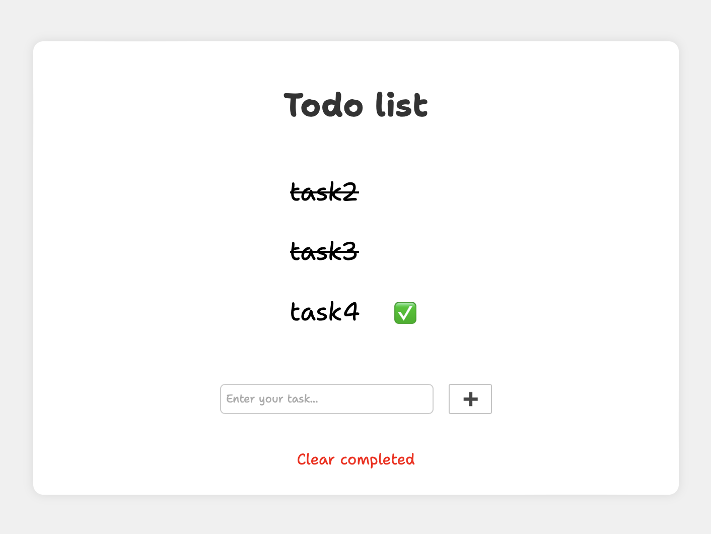

# TODO List


## Console version

This Python program provides a simple todo list manager with the following functionalities:

1. Add a new task.
2. Mark a task as completed.
3. Delete a task.
4. Display all tasks.
5. Load tasks from a JSON file.
6. Save completed tasks to a JSON file.
7. Exit the program.

### Instructions

To use the todo list manager:

Run the program:
```bash
python console_todo.py
```
Choose options from the menu by entering the corresponding number.
Follow the prompts to add, complete, delete, display, load, or save tasks.

### Task Class

The Task class represents individual tasks with the following attributes:

- description: The description of the task.
- completed: A boolean indicating whether the task is completed or not.
- date_added: The date and time when the task was added.
- date_completed: The date and time when the task was completed.

### TaskManager Class

The TaskManager class manages a list of tasks with the following methods:

- ```add_task(description)```: Add a new task to the list.
- ```complete_task(index)```: Mark a task at the specified index as completed.
- ```delete_task(index)```: Delete a task at the specified index.
- ```display_tasks()```: Display all tasks in the list.
- ```save_completed_tasks(filename)```: Save completed tasks to a JSON file.
- ```from_file(filename)```: Load tasks from a JSON file.

### Note

>When saving completed tasks, the completion time (in hours) is calculated based on the time taken from task addition to completion.
> 
>The program avoids saving duplicate completed tasks to the file by maintaining a set of saved completed tasks.

## Web version


This Python web application provides a simple todo list manager with a user-friendly interface. It allows users to add tasks, mark tasks as completed, and clear completed tasks.

### Setup and Installation

Clone the repository:
```bash
git clone <repository_url>
```
Navigate to the project directory:
```bash
cd <project_directory>
```
Install the required dependencies:
```bash
pip install Flask
```
Run the application:
```bash
python app.py
```
Open a web browser and navigate to http://127.0.0.1:5000 to access the todo list.

### Features

- Add Task: Users can add a new task by entering a task description and clicking the "Add" button.
- Complete Task: Tasks can be marked as completed by clicking the checkmark icon next to each task. Once completed, the task will be visually indicated as completed.
- Clear Completed Tasks: Users can clear all completed tasks by clicking the "Clear completed" button. This action removes completed tasks from the list.

### File Structure
| File                     | Description              |
|--------------------------|--------------------------|
| **app.py**               | This file contains the Flask application code, including route definitions and task management logic.       |
| **templates/index.html** | This HTML file defines the structure and layout of the todo list web page. It uses Jinja2 templating to dynamically render tasks.      |
| **static/styles.css**    | This CSS file contains styles for the todo list web page.    |

### Dependencies

Flask: A micro web framework for Python.

### Technologies Used

- Python
- Flask
- HTML
- CSS
- Jinja2 Templating

### Note

> Contributions are welcome! 
> If you find any issues or have suggestions for improvements, please feel free to open an issue or submit a pull request on the GitHub repository.
